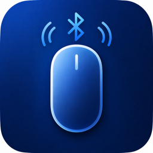

  
  <h1>BlueMouse</h1>
  
iPhone を Bluetooth LE 経由で Mac / Windows のタッチパッド・キーボードとして使うアプリ。

  

    
    
    
    
    
  

---

## 概要

BlueMouse は、手元の iPhone を PC のワイヤレストラックパッド・キーボードに変える小さな道具です。専用ドングルや Wi-Fi、ペアリングサーバーは不要で、Bluetooth LE だけで動作します。

- **タッチパッド** — マルチタッチに対応し、移動・クリック・スクロール・ドラッグを iPhone の画面で行えます。
- **キーボード** — iPhone の標準キーボードでそのまま文字入力。日本語 IME もそのまま使えます。
- **BLE 直結** — iPhone と PC を直接つなぎ、低遅延で動作します。
- **Mac / Windows 対応** — どちらの環境でも同じ iPhone から操作できます。
- **デバイス信頼方式** — 初回に許可した iPhone だけが接続可能。MAC アドレスではなくアプリ発行のデバイス ID で識別し、再接続を安定化。
- **カーソル加速 / スクロール領域** — 細かい操作も大きな移動もストレスなく行えます。

詳しい使い方は [使い方ガイド](https://piggest.github.io/BlueMouse/guide.html) を参照してください。

## ダウンロード

[Releases](https://github.com/piggest/BlueMouse/releases/latest) ページから、お使いの OS に対応するレシーバーアプリをダウンロードしてください。iPhone アプリは TestFlight またはセルフサイドロードでインストールします。

## 動作環境

| プラットフォーム | 要件                                       |
| -------------- | ------------------------------------------ |
| iPhone         | iOS 16 以降                                |
| Mac レシーバー  | macOS 13 Ventura 以降                       |
| Win レシーバー  | Windows 10 1809 以降 + BLE 対応 Bluetooth   |

## ライセンス・ソースコード

このリポジトリでは、リリース成果物とランディングページのみを管理しています。ソースコードは別途プライベートリポジトリで管理しています。

## リンク

- [ランディングページ](https://piggest.github.io/BlueMouse/)
- [使い方ガイド](https://piggest.github.io/BlueMouse/guide.html)
- [Releases](https://github.com/piggest/BlueMouse/releases)
- [Issues](https://github.com/piggest/BlueMouse/issues)
